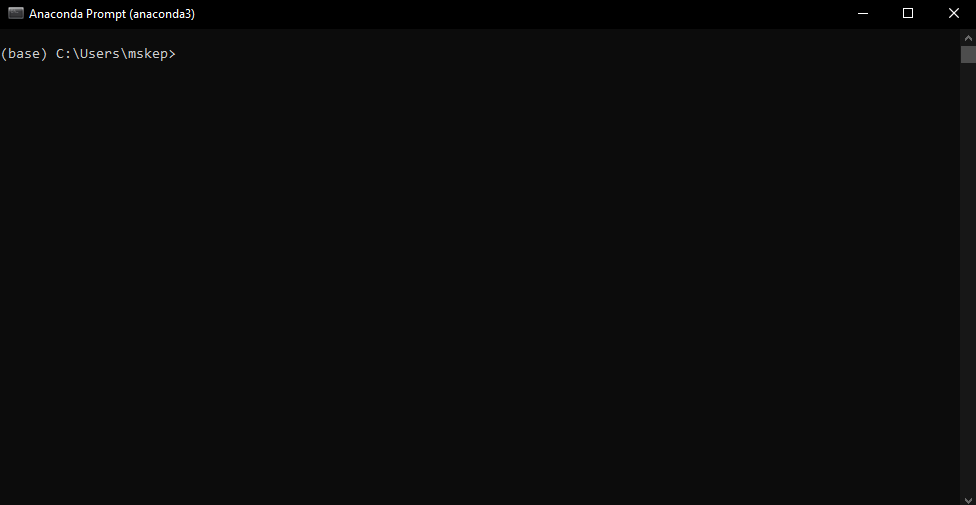

<!-- TABLE OF CONTENTS -->
## Table of Contents

* [About the Project](#About)
* [Prerequisites](#Prerequisites)
* [Setup](#Setup)
    * [Part 1: Anaconda](#Part-1)
    * [Part 2: Compas and Compas Fab](#Part-2)
    * [Part 3: Get libraries from Github](#Part-3)
    * [Part 4: Add libraries to Rhino](#Part-4)
* [Usage](#usage)


<!-- ABOUT THE PROJECT -->
# ARC311 Robotic Simulation & Control w/UR3s <a name="About"></a>
This is the documentation for setting up the software we use for working with Universal Robotics UR3 robotic manipulators
We use compas and compas_fab with the ur_online_control libary with to control and simulate the UR3s.
We also use the assembly_information_model library to send more complicated sets of geometry/commands for the robot, structured in relation to the physical assembly process.

<!-- Prerequisite Software -->
# Prerequisites <a name="Prerequisites"></a>
_We use Rhino 6 and Grasshopper. Below are instructions to install and run Rhino 6 at home (as a Princeton University affiliate)._

### Downloading Rhino:
_Downloading Rhino is already listed on Princeton Websites. So to install the program follow the instructions here:_ [Windows](https://archcomp.princeton.edu/software/install-rhino/install-rhino-6/), [Mac](https://archcomp.princeton.edu/software/install-rhino/install-rhino-6-mac/)

### Running Rhino off-campus:
_Rhino runs on a_ [_zoo server_](https://wiki.mcneel.com/zoo/home) _; therefore, it needs to be connected to a specific network to work. So when you're at Princeton, it is straightforward to run Rhino because you are most likely connected to the network there. At home, however, this is a little more complicated. For this reason, we need a VPN._

1. Go to the following link and download the appropriate VPN software for your computer: https://vpn.princeton.edu/global-protect/getsoftwarepage.esp
2. Set the VPN by following the instructions found in this page under the section <ins>Starting and disconnecting from GlobalProtect on your computer</ins>: https://princeton.service-now.com/service?sys_id=KB0012373&id=kb_article 
3. Now launch Rhino. Once Rhino is running, you can disconnect from the server. But anytime you want to open a new rhino window, you must be connected to the VPN.

# Setup <a name="Setup"></a>
**These are the instructions for installing the software we use on top of Rhino 6.**
## **Part 1: Download Anaconda:** <a name="Part-1"></a>

_In this part you will download Anaconda, distribution of the [Python](https://www.python.org/doc/essays/blurb/) programming language. By installing Anaconda you get everything you need to run Python code. 

1) Go to page: [https://www.anaconda.com/products/individual](https://www.anaconda.com/products/individual)
    1) Hit Download to take you to the location of the installation files 
    2. Install appropriate version<br/>
        * Mac users: graphical installer<br/>
        * Window users: download the appropriate version  
    (If unsure of which version go to _Start button > Settings > System > About_)<br/> <br/>
    &nbsp; &nbsp; <br/> 

2. Open the Anaconda3 installer using default settings 
    1. Install for: Just Me 
    2. Destination Folder: this can be wherever 
    3. Advance options: none 
    4. Last page you may want to uncheck both boxes unless you want those pages to open in your browser 

## **Part 2: Download compas &amp; compas\_fab:** <a name="Part-2"></a>

_In this part you will use the command prompt (terminal if on mac) to install compas and compas\_fab (frameworks that will help you visualize the robots in rhino using grasshopper and python). You can read more about COMPAS and COMPAS\_FAB here:_ [_Compas\_fab_](https://gramaziokohler.github.io/compas_fab/latest/overview.html)_,_ [_Compas_](https://compas.dev/compas/index.html)_. For this installation we will be using a command prompt specific to anaconda (the program we installed in the previous step). It may look intimidating at first. However, once you understand how to use the command prompt/terminal, it can be a very useful tool. If you want to read more about why developers use the command prompt/terminal check_ _[this article](https://www.digitalcitizen.life/what-is-cmd)._

1. Open the anaconda prompt as an administrator
    * Windows: type anaconda prompt in the windows search bar <br/>
        &nbsp; &nbsp; &nbsp; &nbsp; <br/>
    * Mac: Open Launchpad, then click the terminal icon. <br/>
        &nbsp; &nbsp; &nbsp; &nbsp; <br/>

2. Install compas and compas\_fab using the command line. In the anaconda prompt/terminal type in each of the lines below (hitting enter after each line). 
    * You can optionally copy and paste the lines. 
    * The first 4 lines create a _conda environment._ You can rename this environment, which we have written here as arc_311, to be anything you want. **Just make sure you have the same environment name for every step**

```console
conda config --add channels conda-forge
conda remove --name arc_311 --all
conda create -n arc_311 python=3.6 compas=0.15.6 compas_fab=0.11.0 --yes
conda activate arc_311
```
```console
python -m compas_rhino.install
```
```console
python -m compas_fab.rhino.install -v 6.0
```

For the last two steps you will need to allow the anaconda prompt/terminal to make changes to local rhino files. So make sure you are logged in as an administrator.


3. Finally, check to make sure that the installation worked by entering the following lines: <br/>

```console
python
import compas_fab
compas_fab.__version__
```
You should see:
```console
'0.11.0';
```


_In this step we are starting a python file, adding the package compas\_fab (which we installed in the previous step) and requesting the package&#39;s version. You should have installed the most current package. So a version of 0.11.0 or newer should be printed on the screen._ <br/><br/> 

    
## **Part 3: Downloading github &amp; files needed to run robots from grasshopper** <a name="Part-3"></a>

_In this part you will download github desktop. You will use this to get some repositories from the web that will help you work with the robots in grasshopper. We are using github desktop to retrieve these files because we want to clone them instead of downloading them. Cloning is similar to downloading but has the option to update the files if they are changed by the creator._ 

1) Download &amp; setup GitHub for desktop: [https://desktop.github.com](https://desktop.github.com/) 
    1) The proper type of GitHub should appear (i.e. mac, windows x64, etc.) however if it does not just download the appropriate version for your computer.
    2) Click installer for Windows and double click the downloaded zip folder for Mac to install.
    3) Open GitHub desktop.
    4) You don't need to sign in. However, it is recommended that you make an account and sign in.

2) Go to documents and find the GitHub folder
    1) This is where the repositories at default will be saved by default
    2) If you want you can create a subfolder for the repositories from this class (see part 3. v.). Make sure to not have spaces in the name of the subfolder and try to stay away from special characters as well. These specific characters can cause issues when referencing the paths (as we see in iv.)

3) Now we will clone two repositories that will allow us to us grasshopper and python to communicate to the robots _(To clone each repository it is going to be the same process except for the step iii.)_
    1) to file and select clone repository
    2) In the new window select the URL option
    3) Under repository URL type <br/>
        First time: [https://github.com/createchaos/ur_online_control_speckle](https://github.com/createchaos/ur_online_control_speckle) <br/> _These files will help you connect to the robots_ <br/>
        Second time: [https://github.com/createchaos/assembly_information_model](https://github.com/createchaos/assembly_information_model) <br/> _These files will help with creating the robot inside rhino_
    4) Make sure that the local path is correct. Depending on which repository you are downloading it should look something like:
        a. ```C:\Users\name\Documents\GitHub\ur_online_control (or assembly_information_model)``` in Windows
        b. ```\Users\name\Documents\GitHub\assembly_information_model``` in Mac
    5) _(Optional)_ If you created a subfolder change path to ```...\Documents\GitHub\name of your subfolder\ur_online_control (same with assembly_information_model)``` <br/>
     <br/>


4) If these repositories need to be updated you can simply do it with GitHub desktop.
     1. First hit the down arrow beside the current repository and navigate to one of the two we cloned in the steps above.<br/>
       <br/>
     2. GitHub will automatically check to see if the files have been updated. If for some reason it does not, simply click Fetch origin.<br/>
      <br/>
     3. If there is an update, you see a blue box that says pull origin. Click that box and GitHub will update your files so that they match the creator&#39;s. This is why cloning is super useful!<br/>
     <br/>

    
## **Part 4: Add the files to rhino** <a name="Part-4"></a>

_In part 2 when we downloaded compas and compas\_fab we had to add them to rhino. We now need to do that for the repositories we cloned as currently rhino cannot access them._ 

* For Mac:
    1. Copy the directory for the two folders that you just downloaded via Github Desktop (Part 3, step 3)
        * you can select the folder in Finder, and press option+command+c to copy the directory as text
    2. in the terminal, type: ```pip install -e folder_directory``` for _both_ ur_online_control_speckle and assembly_information_model
        * do this step _twice_, replacing the folder_directory with the actual directories from step 1.
    3. in the terminal, type:
        1. ```python -m compas_rhino.install -p ur_online_control```
        2. ```python -m compas_rhino.install -p assembly_information_model```
    4. Done. Now Rhino knows how to access the files you downloaded.

* For Windows:
    1. Open a new Rhino file  <br/>
    2. Type editpythonscript into the command line 
        1) This will open the python\_editor.
    3. Go to tools → options
    4. Add each src file from each of the two repositories installed
        1. To do so hit add to search path (circled in red in photo) <br/>  <br/>
        2. Navigate through your folders to find one of the two repositories.
        3. Click on the repositories folder. Find and select the src folder and hit okay
        4. This should look like \Users\name\Documents\GitHub\ur_online_control\src or \Users\name\Documents\GitHub\assembly_information_mode\src
        5. Then using the up arrow bring that path to the top of the list
        6. Repeat with the second repository <br/>
         <br/>
    5. Finally save the rhino file wherever you want. This makes it so that Rhino remembers the paths.
    6. Done!


        
# Usage
Example files are in the example folder.
